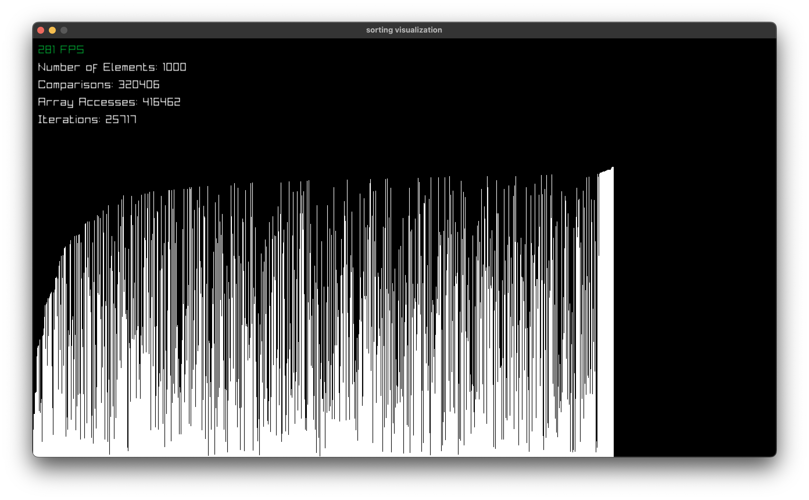

# Sorting Visualization

## Description
This is a small program written in Go that visualizes bubble sort, selection sort, and merge sort. It shows the number of comparisons and array accesses each algorithm uses, It uses the Raylib library for simple graphics.

## How To Run It
First, install the necessary dependencies for Raylib depending on your system. The instructions are located [here](https://github.com/gen2brain/raylib-go).

After this, simply run `go run sorting.go` and enjoy.

If you want to change the sorting algorithm, change which function is used in `sorting.go`. You can select from `sorting.Bubble`, `sorting.Selection`, and `sorting.Merge`.